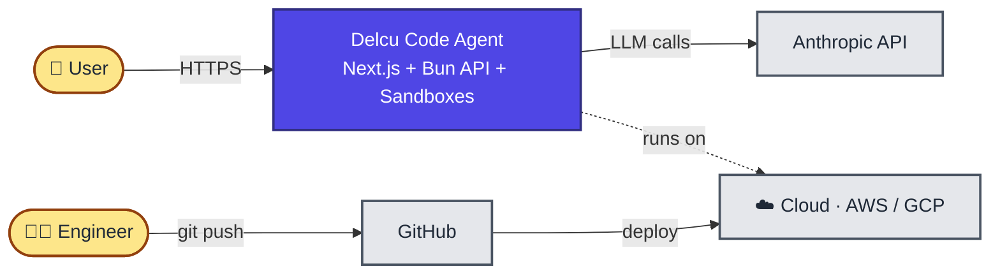
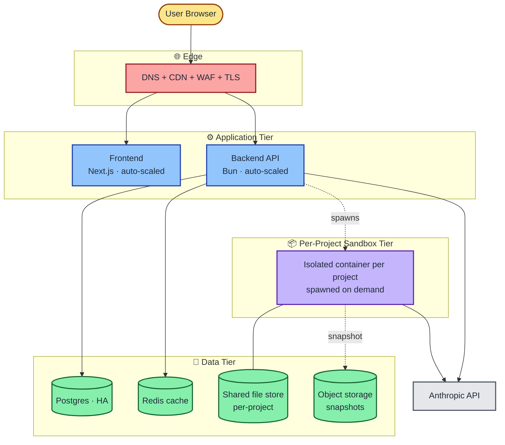
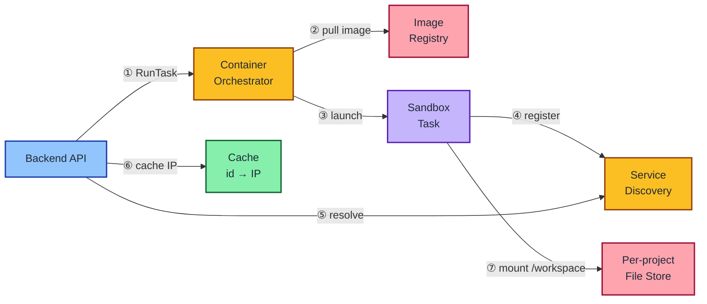
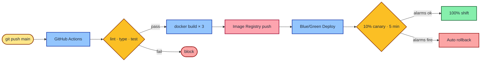
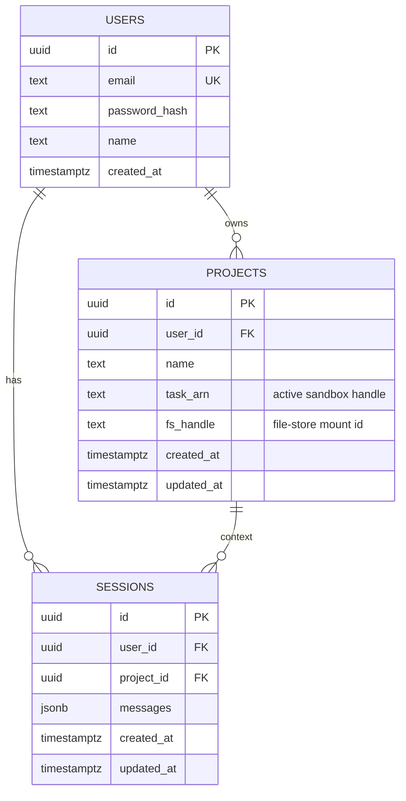
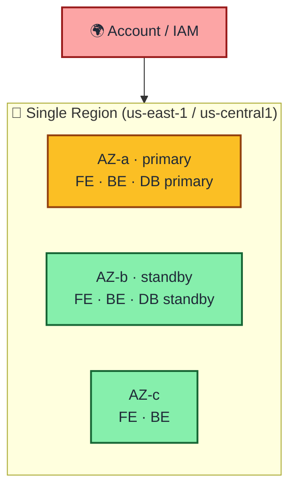

# Delcu Code Agent — Architecture Check-in

Concise architecture review for stakeholder check-in. AWS-first, with GCP cost comparison.

---

## 1. System Context

---

## 2. High-Level Architecture

---

## 3. Sandbox Spawn — Block Diagram

---

## 4. CI/CD Pipeline

---

## 5. Data Model (post-migration)

---

## 6. Blast-Radius / Failure Domains

| Failure | Auto-recover | RTO |
|---|---|---|
| Single app task | Orchestrator reschedules | < 30 s |
| Single AZ | LB drains AZ, DB failover | < 2 min |
| DB corruption | Point-in-time restore | < 30 min |
| Region | Manual DR | < 1 h (acceptable for v1) |

---

## 7. Cost — AWS

| Tier | Small (~50 DAU) | Scale (~1k DAU / 50 sbx) |
|---|---|---|
| Fargate FE + BE | $42 | $180 |
| Sandbox tasks (Spot) | $10 | $250 |
| RDS Postgres | $30 | $280 |
| ElastiCache Redis | $13 | $110 |
| ALB × 2 + NAT | $67 | $90 |
| EFS / S3 / CloudWatch / WAF | $20 | $80 |
| **Total / mo** | **~$182** | **~$990** |

**Knobs:** Fargate Spot −70 % · Single-AZ RDS −50 % · VPC endpoints −$30 · 1-yr Savings Plan −25 %

---

## 8. Cost — GCP

| Tier | Small (~50 DAU) | Scale (~1k DAU / 50 sbx) |
|---|---|---|
| Cloud Run FE + BE | $35 | $200 |
| Cloud Run sandboxes | $15 | $300 |
| Cloud SQL Postgres (HA) | $50 | $300 |
| Memorystore Redis | $35 | $150 |
| Filestore (Basic HDD)* | $200 | $400 |
| Cloud Load Balancing | $20 | $50 |
| Cloud NAT | $32 | $40 |
| Logging / Storage / Armor | $20 | $80 |
| **Total / mo** | **~$407** | **~$1,520** |

\* Filestore minimum is 1 TB → expensive at small scale. Drop it and use **GCS + Persistent Disk** per sandbox to cut **~$200/mo** small, **~$300/mo** scale.

**Knobs:** Cloud Run min-instances=0 −40 % on idle · Spot VMs for sandboxes −70 % · Committed-use discount −25 % · Skip Filestore (above)

### AWS vs GCP — side by side

| Scale | AWS | GCP (with Filestore) | GCP (PD + GCS) |
|---|---|---|---|
| Small | $182 | $407 | ~$207 |
| Scale | $990 | $1,520 | ~$1,220 |

> **Verdict:** AWS is cheaper at every scale here, primarily because Fargate ephemeral storage + EFS access points are cheaper than Cloud Run + Filestore. GCP wins on operational simplicity (Cloud Run scale-to-zero per sandbox is nicer than Fargate `RunTask`).

---

## 9. Decisions Locked In for v1

| Topic | Decision |
|---|---|
| **Multi-region** | ❌ Not required. Single region. |
| **Auth** | ✅ Keep existing JWT (basic auth). No Cognito / Identity Platform. |
| **Sandbox quotas** | ⏭ Defer until after v1 release. Monitor in production. |
| **IaC tool** | ⚠️ TBD — Terraform vs CDK vs Pulumi. Recommend deciding before Phase 0 starts. |
| **Cloud** | ⚠️ AWS recommended on cost. Final call pending. |

---

## 10. Cloud Service Mapping

| Layer | AWS | GCP |
|---|---|---|
| DNS | Route 53 | Cloud DNS |
| CDN / TLS | CloudFront + ACM | Cloud CDN + managed certs |
| WAF | AWS WAF | Cloud Armor |
| Load balancer | ALB | Cloud Load Balancing |
| App compute | ECS Fargate | Cloud Run |
| Sandbox compute | ECS Fargate (RunTask) | Cloud Run (per-service) |
| Service discovery | Cloud Map | Cloud Run URLs |
| Database | RDS Postgres | Cloud SQL Postgres |
| Cache | ElastiCache | Memorystore |
| File store | EFS | Filestore / PD |
| Object store | S3 | GCS |
| Image registry | ECR | Artifact Registry |
| Secrets | Secrets Manager | Secret Manager |
| Logs / Traces | CloudWatch + X-Ray | Cloud Logging + Trace |
| CI/CD deploy | CodeDeploy | Cloud Deploy |
